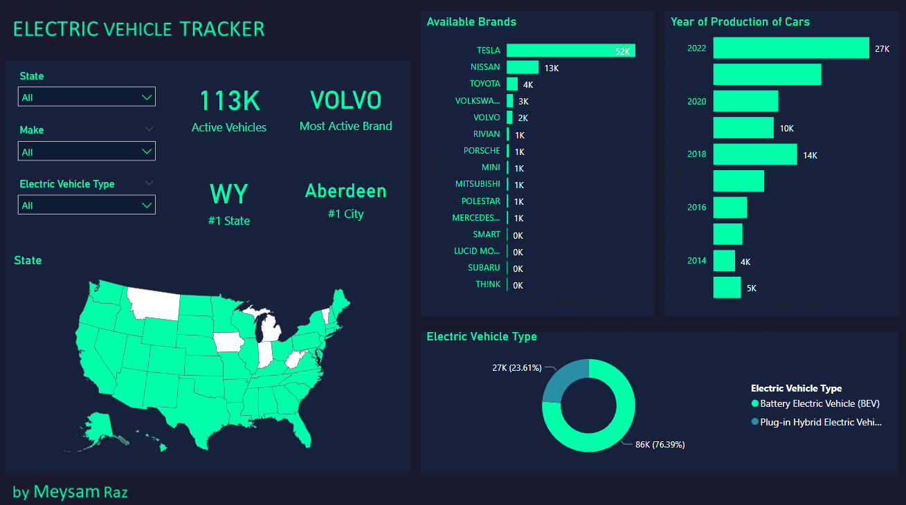

# Electric Cars Tracker Dashboard The US version
Electric cars become so popular this days especially in the U.S . In this project I made a dashboard to track electric cars across the U.S using powerBI . This dashboard is full interactive.

The data that I used for dashboard is available on Kaggle :
[Link of the dataset](https://www.kaggle.com/datasets/ratikkakkar/electric-vehicle-population-data)

- VIN (1-10)
 - Vehicle Identification Number of the vehicle mentioned in the dataset.

- County
  - Name of the County from where the data is gathered.

- City
  - Name of the Cities from where the data is gathered.

- State
  - Name of the State from where the data is gathered.

- Postal Code
  - The postal code from where the data is gathered.

- Model Year
  - Manufacturing year of the model mentioned in the data set.

- Make
  - Manufacturer of the vehicle.

- Model
  - Model Name of the mentioned vehicle.

- Electric Vehicle Type
Type of the vehicle present in the dataset.

## Features of This Dashboard : 
By using this dashboard you be able to track 

-  Number of active electirc cars across the U.S
-  The most purchased car brand
-  State with the most active cars 
-  City of state which has the most electric cars  
-  States where electric cars are available
-  Type of Electric types 
-  Year of manufacture of existing electric cars

#### You are also able to filter data by **state**,**Brand**,and **Type**

## Libraries and software used : 
 
 - [Power BI](https://powerbi.microsoft.com/en/)
